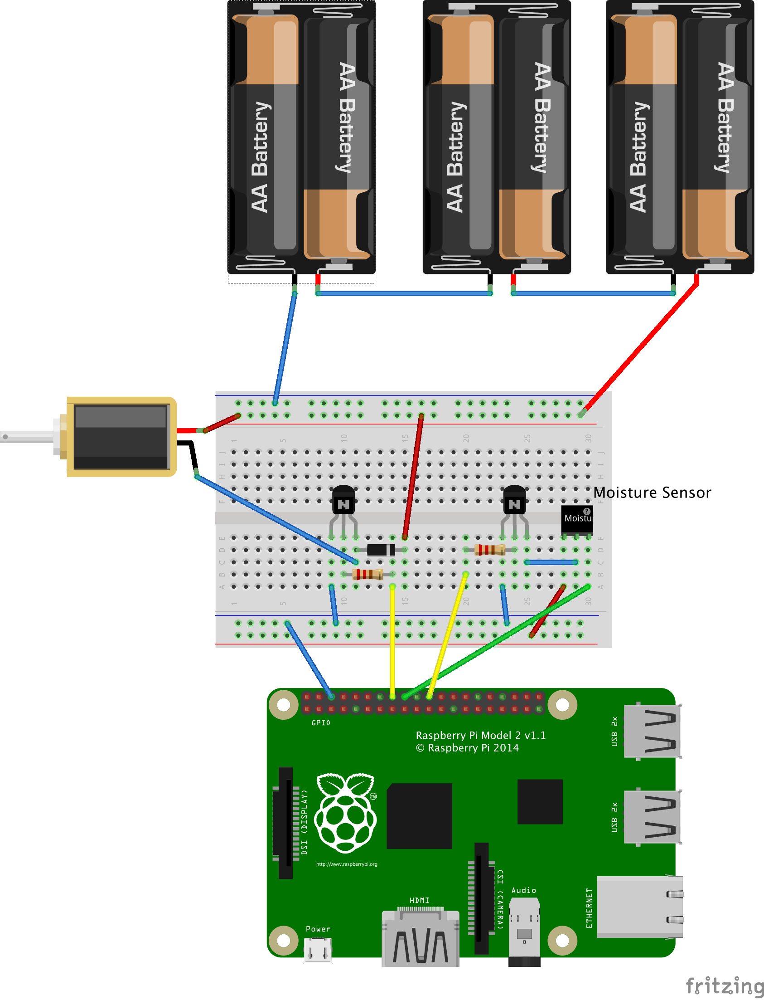

# Raspberry Pi irregation system


## Quickstart

- git clone this repo to your pi and dependencies
- set up your twilio account, jabber account (gmail), forcast.io account
- add the environmental variables and allow sudo to use them (see next section)
- wire up the pi to the valve (or LED) and moisture sensor
- `sudo python garden.py`
- goto connectmypi.com to find your pi

### GPIO: the need for sudo and environmental variables

The python scripts must be either run as *root* to access the GPIO, or the *pi* user must be granted access to them. If using the former method, you'll want to allow a couple enviroment variables set in `/etc/environment` to be available to `sudo`.

These at the moment are:

```
JABBER_ID
JABBER_PASSWORD
FORCASTIO_KEY
TWILIO_TOKEN
TWILIO_SID
FROM_NUMBER
TO_NUMBER
```

To allow *sudo* access to these environment variables, add the following line to `/etc/sudoers` by using `visudo`

```sh
Defaults env_keep += "JABBER_ID JABBER_PASSWORD FORCASTIO_KEY FROM_NUMBER TO_NUMBER TWILIO_TOKEN TWILIO_SID"
```

For the later method of allowing the `pi` user access to the GPIO, try one of these methods: https://www.raspberrypi.org/forums/viewtopic.php?f=44&t=73924
https://github.com/quick2wire/quick2wire-gpio-admin

### Dependencies

The usual python-dev linux stuff and:

    sudo apt-get install python-smbus

Then configure the raspberry pi for i2c via `sudo raspi-config` [following this guide](https://learn.adafruit.com/adafruits-raspberry-pi-lesson-4-gpio-setup/configuring-i2c). Note: under the `Advanced Options` I had to selecet option `A0 Update` for the `raspi-config` tool to provide an I2C option.


Sample console log:

```
2015-07-01 05:49:59.573268 Soil Ok
2015-07-01 05:50:11.289574 Soil Dry
2015-07-01 05:50:23.634059 nothing changed
2015-07-01 05:50:33.990765 nothing changed
2015-07-01 05:50:44.527970 nothing changed
2015-07-01 05:50:54.882961 nothing changed
2015-07-01 05:51:05.224472 nothing changed
2015-07-01 05:51:15.546604 nothing changed
2015-07-01 05:51:25.786950 Soil Ok
2015-07-01 05:51:36.863456 nothing changed
2015-07-01 05:51:47.566889 nothing changed
2015-07-01 05:51:58.254585 nothing changed
```


### Wiring the circuit




### Development
    pip install -r requirements.txt
    nosetests

### TODO
 - [X] document circuit
 - [X] move weather bits into a weather.py
 - [ ] update weather display to include forecast
 - [ ] remove hard coded weather location
 - [ ] make weather getting (API key) optional
 - [ ] move texting bits to messaging.py
 - [ ] make messaging optional (Twilio API key)
 - [ ] parameterize functions for GPIO pins (init them with a setup func)
 - [ ] allow manual (requested) check of moisture
 - [ ] move into a web server (flask, django, bottle, etc) with nginx and whitenoise
 - [ ] investigate using websockets or something like pubnub for real time status, or just AJAX long polling, if pubnub is too pricey and getting twisted/tornado running is a pain or too resource intensive for the pi
 - [ ] add ability to send moisture & temperature readings to external DB (elasticsearch or postgres)

